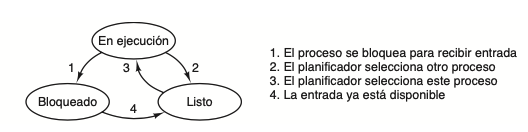
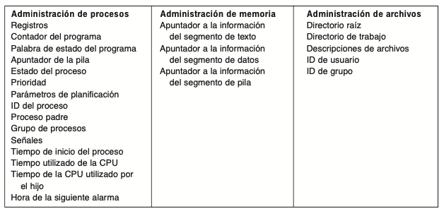
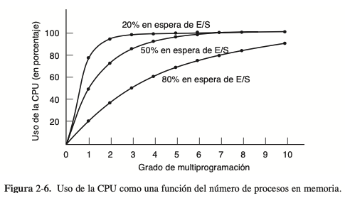
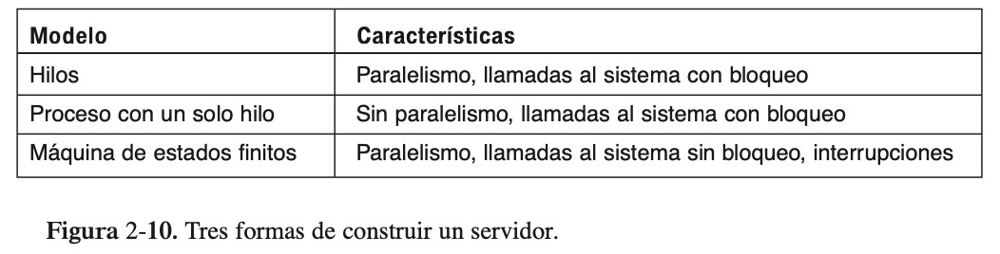
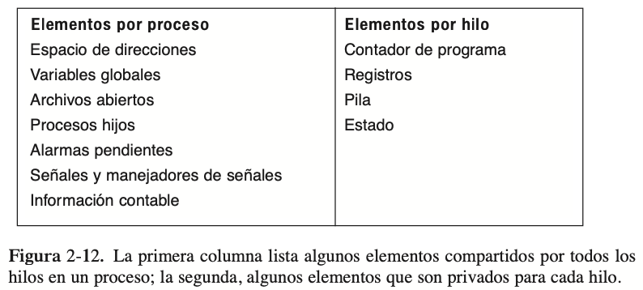
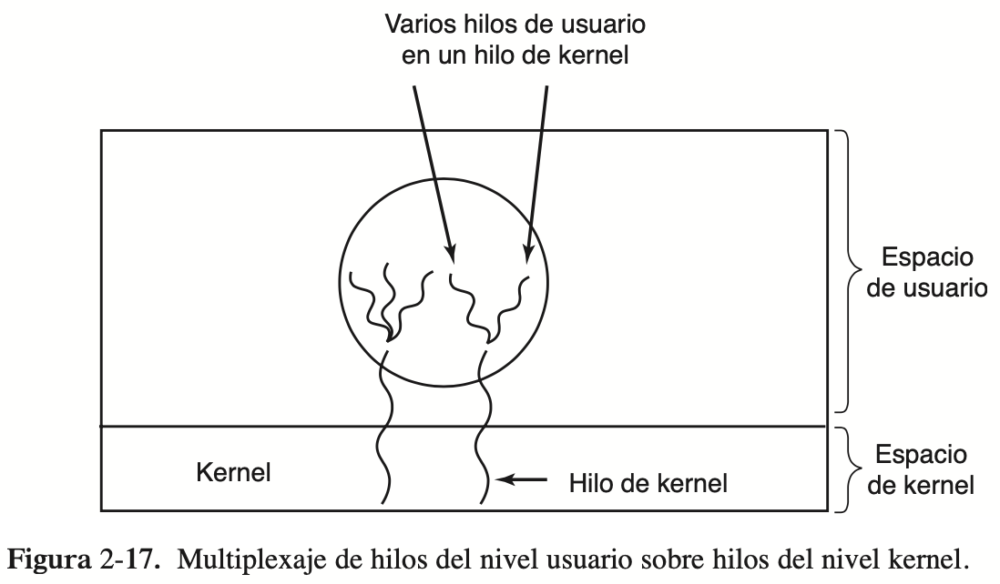
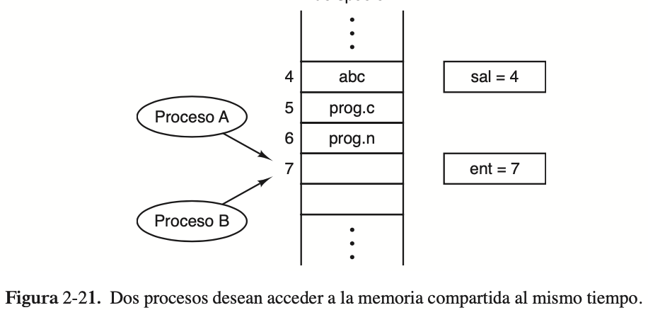
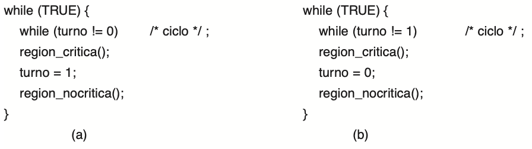
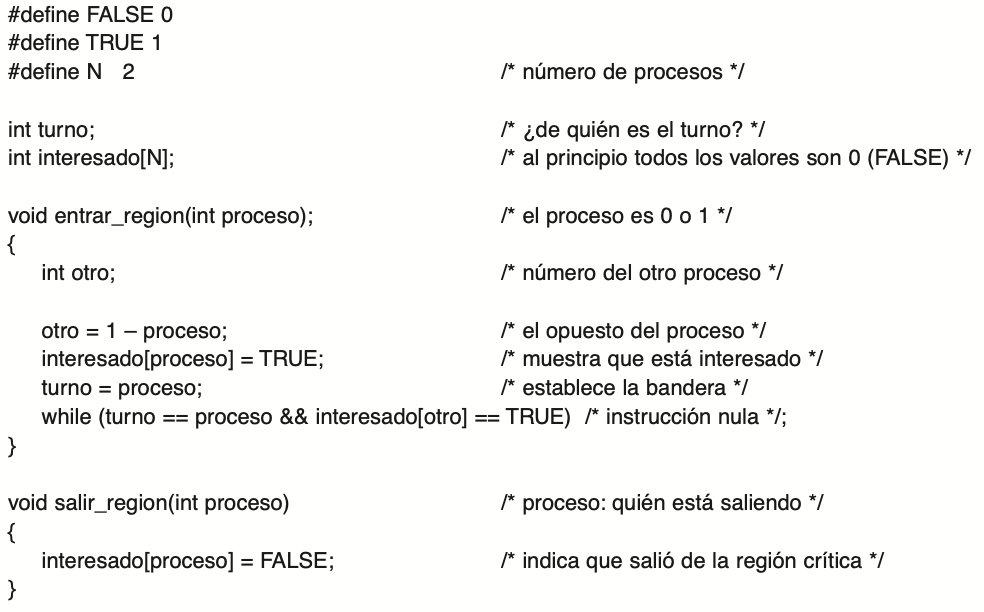

# PROCESOS E HILOS

## Procesos 

### Que es un proceso?

* Es una abstracción de un programa en ejecución.
* Incluye los valores actuales del contador de programa, los registros y las variables.
* Tiene un programa que está ejecutando, una entrada, una salida y un estado.

### Creacion de procesos

Un proceso puede ser creado mediante 4 eventos principales:

1. El arranque del sistema: Se suelen iniciar los daemons como mail input, web server, noticias, etc. Además se inician los procesos en primer plano como el escritorio.

2. La ejecución, desde un proceso, de una llamada al sistema para creación de procesos: Es común que los procesos existentes creen otros procesos para que les ayuden a cumplir su tarea de forma más veloz.

3. Una petición de usuario para crear un proceso: En los sistemas interactivos un usuario puede crear procesos haciendo doble click sobre un icono por ejemplo.

4. El inicio de un trabajo por lotes: Se aplica a los sistemas de procesamiento por lotes que se encuentran en las mainframes grandes.

En UNIX sólo hay una llamada al sistema para crear un proceso: `fork`. Esta llamada crea un clon exacto del proceso que hizo la llamada. Después de fork, los dos procesos (padre e hijo) tienen la misma imagen de memoria, las mismas cadenas de entorno y los mismos archivos abiertos. Por lo general, el proceso hijo ejecuta después a `execve` o una llamada al sistema similar para cambiar su imagen de memoria y ejecutar un nuevo programa. Al crear un proceso mediante `fork`, a priori no se comparte memoria entre el padre y el hijo.

### Terminacion de procesos

Condiciones para la terminación de un proceso:

1. Salida normal (voluntaria): Un proceso puede terminar porque su trabajo aquí ha terminado, para esto ejecutan la llamada al sistema `exit` en UNIX. Este caso también se puede dar en los programas orientados a pantalla, básicamente cuando apretamos la `x`.

2. Salida por error (voluntaria): Por ejemplo, si un compilador recibe como parámetro un archivo inexsistente termina el proceso y se acabó.

3. Error fatal (involuntario): Suele ser por un error en el programa y es un error que hace que explote todo (division entre cero, stack overflow, page fault), en UNIX el proceso puede elegir handlear el error por si mismo en vez de terminar la ejecución.

4. Eliminado por otro proceso (involuntario): Un proceso puede elegir matar a otro mediante la syscall `kill`, siempre y cuando tenga los permisos necesarios.

### Jerarquias de procesos

UNIX maneja una jerarquia, en la que existe un proceso raiz denominado `init`, el cual en el arranque crea varios procesos que serán sus hijos, a su vez cada uno de estos procesos puede crear otros procesos, nietos de `init` e hijos de quien los creo. Cada proceso debe tener un único padre (a excepción de `init` que no tiene ninguno) y puede tener tantos descendientes como sea necesario.

En contraste Windows no tiene una jerarquía de procesos, todos se encuentran en el mismo nivel. El único indicio de una jerarquía es que al crear un proceso, el proceso creador recibe un *token* que puede utilizar para controlar al hijo. El tema es que este proceso puede compartir el token con otros, rompiendo así la jerarquía.

### Estados de un proceso

Existen 3 estados posibles para los procesos:

1. En ejecución: El proceso tiene el poder de la CPU en ese instante.

2. Listo: El proceso está listo para ser ejecutado, pero la CPU está siendo usada por otro proceso.

3. Bloqueado: El proceso no puede ejecutarse hasta que ocurra cierto evento externo.

Veamos ahora un diagrama con estos estados y como se realiza la transición entre los mismos:



La transición 1 se da de forma manual cuando un proceso pide acceso a algún recurso que no está disponible en ese momento. Cuando ese recurso esté disponible se disparará la transición 4 y el proceso pasará a estar listo para ser ejecutado.

Las transiciones 2 y 3 son transparentes para el proceso y son delegadas al scheduler, cuando el mismo considere que un proceso ya tuvo la CPU por mucho tiempo se lo saca y comienza la transición 2, y cuando considere que es momento de que el mismo vuelva a tener CPU se lo devuelve mediante la transición 3.

### Implementación de los procesos

Para implementar el modelo de procesos, el sistema operativo mantiene una tabla llamada `tabla de procesos` (PCB por sus siglas en ingles), con sólo una entrada por cada proceso. Esta entrada contiene la siguiente información:

* Contador de programa

* Apuntador de pila

* Asignación de memoria

* Estado de los archivos abiertos

* Información de contabilidad y planificación

* Demás información necesaria acerca del proceso cuando este es removido del uso de la CPU.

La utilidad de esta `PCB` es la de poder reiniciar al proceso de forma transparente como si nunca se lo hubiera detenido. Podemos ver ahora una table que muestra los campos contenidos en la `PCB` para la administración de procesos, memoria y archivos.



Veamos ahora que pasa cuando un proceso recibe una interrupción de entrada/salida. Cada una de estas interrupciones tiene una ubicación asociada a la cual se la llama `vector de interrupción`. Esta ubicación tiene la dirección de memoria donde comienza el procedimiento que se debe disparar cuando dicha interrupción ocurre. Se muestra ahora un esqueleto de lo que ocurre cada vez que se dispara una interrupción:

1. El hardware de interrupción mete el `PC` y algunos registros del proceso actual a la pila.

2. El hardware carga el nuevo `PC` del vector de interrupciones.

3. Un procedimiento de ASM guarda los registros del proceso actual en su entrada de la `PCB`.

4. Un procedimiento de ASM establece una nueva pila temporal para el manejador de procesos.

5. Se ejecuta el procedimiento de interrupciones (por lo general hecho en C).

6. El scheduler toma el control y decide a quien darle CPU.

7. Un procedimiento en C regresa a un codigo ASM.

8. Un procedimiento en ASM inicia el nuevo proceso actual (reestablece registros, pila, etc...).

### Modelación de la multiprogramación

La multiprogramación es un intento de aprovechar al máximo el uso de la CPU. Por ejemplo, si tengo 5 procesos corriendo en forma secuencial que cada uno gasta el 80% de su tiempo esperando entrada/salida, el uso final de la CPU es de un 20%, lo cual es málisimo porque la tengo quemando ciclos un 80% del tiempo. En cambio, si cada vez que un proceso está esperando una entrada le deja su CPU a otro proceso que esté listo, potencialmente podemos mejorar ese uso de CPU a 100%. Esto igual es muy optimista porque asume que nunca van a estar los 5 procesos esperando a la vez.

Es por esto que se usa un modelo probabilistico el cual dice que:

$$uso \ de \ CPU = 1 - p^{n} $$

Siendo $p$ la probabilidad de que un proceso esté esperando entrada/salida y $n$ la cantidad de procesos en memoria. Haciendo un gráfico en donde se varían estos párametros podemos ver lo siguiente:



Básicamente mientras más probabilidad tengan los procesos de estar esperando, más procesos vamos a necesitar en memoria para no desperdiciar CPU. Por ejemplo, si los procesos gastan 80% de su tiempo esperando E/S, por lo menos debe haber 10 procesos en memoria a la vez para que el desperdicio de la CPU esté por debajo de 10%.

Veamos un ejemplo donde agregar memoria podría mejorar el rendimiento de nuestra CPU:

    Supongamos que una computadora tiene 512 MB de memoria, de la cual el sistema operativo ocupa 128 MB y cada programa de usuario ocupa otros 128 MB. Estos tamaños permiten que haya tres programas de usuario en memoria a la vez. Con un promedio de 80% de tiempo de espera de E/S, tenemos una utilización de la CPU de aproximadamente 49%. Si agregamos 512 MB más de memoria, el sistema puede pasar de la multiprogramación de tres vías a una multiprogramación de siete vías, con lo cual el uso de la CPU se eleva hasta 79%. En otras palabras, los 512 MB adicionales elevarán el rendimiento por 30%.
    Si agregamos otros 512 MB, el uso de la CPU sólo se incrementaría de 79 a 91%, con lo cual se elevaría el rendimiento sólo en 12% adicional. Utilizando este modelo, el propietario de la computadora podría decidir que la primera adición es una buena inversión, pero la segunda no.

## Hilos

### Uso de hilos

La principal razón para usar hilos es que en muchas aplicaciones se desarrollan varias actividades a la vez. Algunas de las cuales se pueden bloquear cada cierto tiempo. Si descomponemos estas aplicaciones en varios hilos que se ejecutan en cuasi-paralelo, el modelo de multiprogramación se simplifica.

Los hilos nos aportan la habilidad de compartir un espacio de direcciones y todos sus datos.

Otra razón para usar hilos es que, al ser estos más ligeros que los procesos, son más fáciles de crear/destruir. Estas acciones suelen ser entre 10 y 100 veces más rápidas en los hilos que en los procesos. Por eso, cuando el numero de hilos cambia de manera dinámica y rápida, es útil tener esta propiedad.

Si todos los hilos de una aplicación están ligados al uso de CPU, no se notará un incremento en el rendimiento. Sin embargo, si se delega por ejemplo, un hilo al uso de CPU y otro al de manejo de E/S es esperable una mejora de rendimiento notable.

En resumen, los hilos permiten que exista el concepto de procesos secuenciales que realizan llamadas al sistema con bloqueo y de todas formas lograr un pararelismo.

Entonces, mantener un solo hilo mantiene un modelo simple con syscalls bloqueantes, pero puede perder mucho rendimiento. Añadir los hilos, nos permite usar syscalls bloqueantes sin un compromiso en el rendimiento debido a la multiprogramación.

Existe sin embargo una tercera alternativa, cuando no es posible aceptar el bajo rendimiento de las syscalls bloqueantes pero tampoco es posible acceder a un sistema con hilos. En este caso, se pueden realizar syscalls no bloqueantes pero la verdad que es un quilombo programar de esta forma, la mega ventaja es que logras el alto rendimiento de antes con una compu más berreta, pero salvo que seas Richard Hendricks, es muy recomendable evitar esto.



### El modelo clásico de hilo

Separemos primero 2 conceptos independientes en los cuales se basan los procesos:

1. Agrupamiento de recursos

2. Ejecución

Una forma de ver un proceso, es como una forma de agrupar recursos relacionados, como por ejemplo datos del programa, archivos abiertos, procesos hijos, etc...

Por otro lado, también lo podemos ver como un hilo de ejecución, el cual tiene un `PC`, una pila que suele usar para guardar el historial de procedimientos que hayan sido llamados que aún no hayan terminado.

Entonces, lo que agregan los hilos a lo que teníamos antes, es justamente eso, hilos de ejecución, un proceso ahora puede agrupar un conjunto de recursos relacionados, pero además de eso tener varios hilos de ejecución, todos estos compartiendo variables y datos entre si, pero siendo totalmente independientes en el código que ejecutan.

Veamos una síntesis de los elementos que contienen tanto los hilos como los procesos:



Algo a saber es que los hilos tienen los mismos estados que los procesos: listos, en ejecución y bloqueados. Y sus transiciones suceden exactamente de la misma forma que en los procesos.

Los hilos igual pueden traer problemas, especialmente porque comparten recursos y pueden introducir condiciones de carrera, además plantean situaciones innteresantes como por ejemplo que pasa si un proceso con varios hilos llama a `fork`. ¿deberá el hijo tener estos hilos también? Si no es así, el proceso podría no funcionar en forma apropiada, ya que todos ellos podrían ser esenciales.

No obstante, si el proceso hijo obtiene tantos hilos como el padre, ¿qué ocurre si un hilo en el padre se bloqueó en una llamada `read`, por ejemplo, del teclado? ¿Hay ahora dos hilos bloqueados en el teclado, uno en el padre y otro en el hijo? Cuando se escriba una línea, ¿obtendrán ambos hilos una copia de ella? ¿Será sólo para el padre? ¿O sólo para el hijo? El mismo problema existe con las conexiones abiertas de red.

### Implementación de hilos en el espacio de usuario

Una clara ventaja de implementar los hilos de esta forma, es que se podrían usar los mismos en sistemas operativos que no soporten los hilos, porque para el `SO`, estaría tratando con procesos de forma totalmente transparente, pese a que estos procesos internamente estén usando hilos.

Para implementar hilos de esta forma es necesario que cada proceso mantenga una tabla de hilos privada con la información necesaria, es decir, su estado, pila, `PC`, etc...

Cuando un hilo pase de listo a bloqueado, se deben guardar todos los datos correspondientes a ese hilo en la tabla, buscar el proximo hilo que esté listo y cargar su contenido en el contexto de ejecución actual.

Esta forma de actuar es mucho más veloz que si los hilos estuvieran implementados en el kernel, ya que allí, para realizar el cambio de contexto entre hilos, sería necesario un cambio de privilegios para situarse en el kernel, que el mismo realice todas las operaciones necesarias para poner el siguiente hilo en funcionamiento, y luego otro cambio de privilegios para volver al espacio de usuario.

Otra ventaja, es que de esta forma cada proceso puede tener su propio algoritmo para el scheduler de hilos. Además, como el espacio de usuario cuenta con un tamaño de memoria mucho mayor, no van a haber limitaciones en la cantidad de hilos que puede tener el sistema, o sus limitaciones van a ser significativamente menores, ya que de guardar la tabla de hilos en el kernel se estaría tomando espacio de una memoria que desde el vamos, es escasa.

Un pedazo de problemon que tienen los hilos a nivel de usuario es que no es para nada trivial como implementar las syscalls bloqueantes, porque para que un hilo pase de listo a bloqueado tiene que ceder voluntariamente su puesto mediante una función provista por la API de hilos en espacio de usuario (llamemosla `thread_yield`), pero si realiza una syscall bloqueante
no va a llegar a llamar a `thread_yield`, justamente porque está bloqueado.

Una solución para esto es modificar todas las syscalls bloqueantes por unas que cumplan la misma función, pero que no tengan bloqueo. Esta solución es pésima porque implicaría modificar el `SO`, lo cual tira abajo el primer argumento que teníamos de poder usar hilos en `SO` que a priori no los soportaban. O sea, ya que tenemos que tocar el `SO` mejor agregarle hilos y ya fue.

Otra solución, igual de berreta, es la de preguntar al `SO` si una syscall se va a bloquear mediante la syscall `select`, si la primera se va a bloquear entonces no se hace y se le pasa el control a otro hilo, caso contrario, se realiza la syscall. Acá también hay que volver a escribir algunas partes del `SO`, además es poco eficiente asi que no aporta nada nuevo.

Otro problema con usar hilos en espacio de usuario, es que si el hilo que se está ejecutando dispara un `page fault` porque quiso buscar una instrucción del programa que no estaba cargada, el kernel, que no tiene ni idea que los muchachines estaban usando hilos, va a parar todo el proceso mientras carga las instrucciones faltantes en memoria y los otros hilos que estaban listos para seguir se van a quedar esperando sentados solo porque un hilo se bloqueo.

Otro problemon de los hilos en espacio de usuario (si, son todos problemas al final), adentro de un proceso no existen las interrupciones de reloj, asi que si un hilo no entrega voluntariamente la `CPU`, nadie se la va a poder sacar, asi que más te vale ser buena gente cuando programes esos hilos.

Podrías arreglar esto pidiendole al sistema que haga esas interrupciones de forma periodica, pero la verdad hace que el código sea más complicado y suele hacer todo mucho más lento. Además, suponete que justo tu hilo usaba interrupciones de reloj para otra cosa, vas a tener una interferencia que vas a rezar pasarte a una carrera donde nunca más toques una compu.

### Implementación de hilos en el kernel

Acá el diseño es mucho más simple, el kernel ahora maneja una tabla de hilos, donde en cada entrada guarda la información necesaria de cada hilo (estado, registros, `PC`, etc...), cuando un hilo crea otro hilo se agrega una entrada a la tabla, cuando se mata al hilo se la elimina. Obviamente, el kernel sigue teniendo por separado la tabla de procesos.

A diferencia de la implementación a nivel de usuario, cuando un hilo pasa al estado bloqueado, el kernel toma el control y le da la `CPU` a otro hilo que esté listo, pertenezca o no al mismo proceso del hilo al cual le fue sacada la `CPU`.

En esta implementación tenemos un problemilla y es que crear/destruir hilos es bastante caro. Para atacar este problema se opta por una solución muy copada que es la de reciclar los hilos, es decir, si en algún momento alguien quiere matar un hilo, yo como kernel le digo al muchacho que lo maté y que nunca más lo va a molestar, pero en realidad solo me marqué en una libretita que ese hilo está fuera de servicio, y cuando alguien quiera un hilo nuevo, yo en vez de crear uno al pedo, agarro al que estaba fuera de servicio y lo saco a la pista de nuevo en un periquete. Esta alternativa obvio que también se podía usar en el nivel de usuario, pero la verdad que ahí todo era rapidísimo, así que no valía la pena el código extra.

Pese a que con lo charlado ya se puede deducir, no está demás decirlo explicitamente, esta implementación no tiene ningún problema con las syscalls bloqueantes ni con los `page faults` ya que en ambos casos el kernel toma el control y considera a los otros hilos del proceso que realizo el bloqueo como listos (siempre y cuando los hilos estén listos).

### Implementaciones hibridas

Básicamente es un frankenstein que trata de tener las ventajas de los 2 métodos, tiene tanto hilos en el espacio de usuario como en el kernel. Al usar este método, el programador elige cuantos hilos quiere que el kernel tenga, y cuantos hilos de nivel de usuario quiere que cada hilo de kernel tenga. Con esto te vas a ahorrar bastantes llamadas al kernel ya que vas a tratar de manejar más cosas desde el lado de usuario que es más rápido, pero te podés asegurar que si un hilo de usuario se bloquea, al menos le puede pasar la posta a alguno de los hilos que están en otro hilo del kernel. Un esquemita de como se vería esta implementación se puede ver a continuación:



### Activaciones del planificador

Es evidente que los hilos del kernel son bastante superiores a los hilos en espacio de usuario, pero es verdad también que son bastante más lentos. Es por eso que se buscaron formas de mejorar esta situación sin renunciar a las bellas ventajas que estos hilos nos dan.

Lo que se quiso hacer con la activación del planificador, fue imitar a los hilos del kernel, pero sin perder tanto tiempo haciendo idas y venidas entre espacio de usuario y kernel. Manteniendo la capacidad de usar syscalls bloqueantes sin ningún chequeo berreta previo para ver si las cosas van a explotar o no.

La solución vino al darse cuenta que por ahí no hace falta meter siempre al kernel en el medio, si un hilo está bloqueado porque necesita que otro hilo termine su ejecución, nos podemos encargar directamente en espacio de usuario de sacar al hilo bloqueado y meter alguno que esté listo.

Cuando se usan las activaciones del planificador, el kernel le asigna cierto número de procesadores virtuales (o reales si hay varios procesadores físicos) a cada proceso. Al principio, a un proceso se le asigna solo un procesador, pero de ser necesario este puede pedir más, o devolver los que ya no use. Además, el kernel tiene el derecho a revocar procesadores a quien se le antoje y cuando se le antoje con el objetivo de darselos a procesadores más necesitados.

La idea básica de este esquema es que el kernel se ocupa de la menor cantidad de cosas posibles. Cuando le llega que un hilo se bloqueo, este lo único que hace es avisarle al planificador pasandole como parámetros el número de hilo bloqueado y una descripción de que es lo que pasó (`upcall`).

De ahí en más el sistema en espacio va a marcar al hilo como bloqueado y a poner a funcionar alguno que esté listo. Cuando al kernel le llegue una señal de que el hilo bloqueado se puede reanudar, va a tirar otra `upcall` diciendo que el hilo ya está listo, pero ahora el sistema en ejecución va a recibir el mensaje y actuar en consecuencia cuando le parezca más conveniente.

Un problema con este esquema es que rompe un poco la estructura inherente de un sistema por capas. Es decir, lo lógico sería que el sistema de usuario le pida cosas al kernel, pero en este caso está pasando todo lo contrario.


### Hilos emergentes

Los hilos son muy usados en los sistemas distribuidos, por ejemplo cuando son los encargados de manejar peticiones que le llegan a un servicio. La forma de hacer esto de toda la vida es la de tener a un proceso o hilo bloqueado escuchando por peticiones, y que cuando esta llega se acepta la petición, se la analiza y por último se la procesa.

Pero pero pero, hay un método que es bastante mejor, se puede tener a un hilo que solo se encargue de escuchar peticiones, y que si llega alguna, lo único que haga sea crear un hilo y pasarle el bodrio a ese hilo. Estos hilos, son los llamados hilos emergentes. Una ventaja que tienen es que al ser hilos nuevos y que van a ser todos iguales entre si, es que son rápidos de crear y no necesitan restaurar ningún valor de la pila o los registros. De esta forma, logramos que el tiempo que pasa entre la llegada del mensaje y el inicio del procesamiento del mismo sea muy baja.

Igual no son todo color de rosas con los hilos emergentes, hay que tener cuidado y pensar bien como se van a ejecutar. Por ejemplo, podría hacer que los hilos emergentes se ejecuten en el kernel, esto sería más rápido y sencillo que hacerlo en nivel de usuario. Un hilo que se ejecute en el kernel tiene acceso a todas las tablas del mismo y a los dispositivos de E/S. El temilla con esto es que en la que te mandaste un moco y estás ejecutando código en el kernel no hay quien te salve, porque spoiler, si en algún momento te equivocaste y un proceso en espacio de usuario quiere tomar el control de la compu cae el kernel y lo baja con un golpe de realidad. Pero si ese código está en el kernel, el ministerio de magia ha caido, solo queda sentarse y esperar a que la compu explote.

## Comunicación entre procesos

Hay 3 grandes problemas cuando los procesos necesitan comunicarse:

1. Como un proceso puede pasarle información a otro.

2. Como hacer que 2 procesos no se interpongan entre si, es decir, si quieren acceder al mismo recurso a la vez, luego del acceso al recurso, los 2 procesos deberían tener una misma versión de los hechos, por ejemplo, el proceso A accedió, y el proceso B llegó muy tarde.

3. Como hacer para que se cumpla una secuencia apropiada cuando un proceso depende del otro, por ejemplo, si el proceso B depende del proceso A, el primero no debería ejecutarse hasta que el segundo lo indique.

Los problemas 2 y 3 aplican tanto a hilos como a procesos, y sus soluciones son las mismas. El problema 1 no existe en los hilos, ya que estos parten de tener memoria compartida.

### Condiciones de carrera

Veamos como funciona la comunicación entre procesos cuando hay 2 procesos que comparten unn espacio de memoria en el que pueden leer y escribir.

Supongamos que 2 procesos quieren guardar datos en un archivo compartido que funciona por filas, es decir, si yo guardo algo se almacena en la fila $i$ y el proximo que quiera guardar un dato lo va a tener que hacer en la fila $i + 1$. Para esto, le preguntamos al proceso que se encarga de mantener el archivo cual es la siguiente linea disponible y este devuelve el valor que tenga en `ent`.

Supongamos ahora, como se ve en la figura de abajo, que el archivo ya está lleno hasta la fila $6$ y los procesos A y B quieren escribir un nuevo dato.



Primero el proceso A pregunta cual es la siguiente entrada libre y recibe un $7$, A guarda este valor en la variable `nextFreeSlot`. Justo justo justo el kernel decide sacarle la `CPU` y darsela a B, este proceso también pregunta cual es el siguiente espacio libre y recibe un $7$ como respuesta. B se guarda este valor en `nextFreeSlot` y procede a escribir el dato en el archivo y a actualizar el valor de `ent` a 8.

Ahora le toca de nuevo a A, que sigue desde donde se había quedado y guarda su dato en su `nextFreeSlot`, o sea, en donde ya había guardado su dato B pisandole sus valores, luego de eso procede a guardar el valor 8 en `ent`.

Situaciones como ésta, en donde dos o más procesos están leyendo o escribiendo algunos datos compartidos y el resultado final depende de quién se ejecuta y exactamente cuándo lo hace, se conocen como condiciones de carrera.

### Regiones criticas

Para evitar las condiciones de carrera tenemos que lograr de alguna manera que 2 procesos no puedan usar el mismo recurso al mismo tiempo. Es decir, si A quiere usar un recurso, tenemos que poder asegurar que nadie más lo va a tocar hasta que A termine, esto se llama `exclusión mutua`.

Planteado de una forma más abstracta, esas zonas de código donde un proceso accede a memoria compartida o hace alguna cosa crítica que puede generar condiciones de carrera, se pueden llamar `regiones criticas`. Podemos evitar condiciones de carrera si nos aseguramos que en todo momento solo hay a lo sumo un proceso en la `región crítica`.

Esto solo no alcanza para asegurar que los procesos en paralelo cooperen de la manera correcta al usar datos compartidos. Necesitamos cumplir 4 condiciones:

1. No puede haber dos procesos de manera simultánea dentro de sus regiones críticas.

2. No pueden hacerse suposiciones acerca de las velocidades o el número de CPUs.

3. Ningún proceso que se ejecute fuera de su región crítica puede bloquear otros procesos.

4. Ningún proceso tiene que esperar para siempre para entrar a su región crítica.

### Exclusión mutua con espera ocupada

Ahora vamos a ver varios enfoques para lograr la exclusión mutua.

#### Deshabilitando interrupciones

Si tu sistema tiene un solo procesador deshabilitar las interrupciones cuando entrás a la sección crítica y habilitarlas cuando salís es lo más fácil que podés hacer, porque un procesador sin interrupciones no te puede desalojar y si no te puede desalojar vos estás re tranqui panqui para hacer tus cosas críticas. El tema es que nadie le quiere dar tanto poder a un proceso en espacio de usuario, porque si te mandás algún moco (por no decir, cuando te mandes un moco) y te quedás colgado sin volver a habilitar las interrupciones no va a haber nadie que te salve, ese sistema se colgó para siempre.

Para sistemas multiprocesador esta solución directamente no funciona porque cuando vos deshabilitas las interrupciones lo haces solo en el procesador actual, los demás procesadores siguen teniendo interrupciones y sus procesos podrían tocar los datos compartidos.

Esto no quiere decir que deshabilitar interrupciones sea algo malo siempre, con frecuencia el kernel deshabilita las interrupciones cuando tiene que actualizar listas o variables. Por ejemplo, si un proceso quiere tomar el control mientras la tabla de procesos se encuentra en un estado inconsistente, es imperioso primero arreglar la tabla de procesos para evitar condiciones de carrera.

#### Variables de candado

Podemos usar una variable compartida que nos sirva de candado, por ejemplo tener el booleano `blocked`. Este se inicializa en falso y cuando un proceso quiere entrar a la región crítica, primero verifica que `blocked` sea falso, y si ese es el caso entra a la región crítica y cierra el candado poniendo true en `blocked`. Si en primera instancia `blocked` estaba en true, el proceso se llamaba a esperar y probaba de nuevo más tarde.

Esta solución en realidad no tiene nada de solución, porque a priori las variables candado tiene exactamente los mismos problemas que tienen las variables y archivos compartidos, asi que, canceladisima.

#### Alternancia estricta

Este método no es ni más ni menos que un algoritmo para que 2 procesos se vayan turnando para entrar a la región crítica.



Pese a que este algoritmo evita todas las condiciones de carrera, no es un candidato serio como solución ya que no cumple con la condición 3 antes planteada, un proceso está siendo bloqueado por otro que no está en su sección crítica.

Por ejemplo, supongamos que la región no crítica del proceso B es hacer una suma de 2 enteros chiquitos, mientras que la región no crítica del proceso A es crackear contraseñas por fuerza bruta. Al comienzo, el proceso A pasa por la región crítica y al salir deja que B entre en la misma. Casi de manera instantanea B termina ambas de sus regiones y ya está listo para hacer la región crítica de vuelta, lo que no sabe es que ahora es el turno de A, y A acaba de probar la combinación 34 y todavía le faltan 50 millones. Ahí B se quedó re caliente, imaginate, A se pidió la región crítica y no la iba a usar hasta dentro de 2 días.

Otra cosa a remarcar, es que cuando uno de los procesos está esperando para entrar se queda dando vueltas en el while quemando ciclos de `CPU`, a esto se lo conoce como `busy waiting` y no está para nada copado porque literal es un desperdicio de poder de cómputo.

Por lo tanto, podemos calificar a esta solución como pésima.

#### Solución de peterson

Peterson trajo a la mesa otro algoritmo, con la única diferencia de que este si funcionaba y si está bueno. Veamoslo en la figura de abajo:



No me voy a gastar en explicarlo porque el Tanenbaum lo hace muy bien, pero creeme que este algoritmo evita todas las condiciones de carrera y cumple con los requisitos planteados al principio. Lo único reprochable es que hace `busy waiting`, pero bueeeeeno, todo no se puede.

### La instrucción TSL (Test and Set Lock)

Esta instrucción es una facilidad que nos da el hardware y tiene esta pinta:

```
TSL registro, candado
```

Por adentro esta instrucción hace lo siguiente:

```
MOV registro, candado // Muevo al registro el contenido del candado
MOV candado, #1        // Seteo el candado en 1  
```

La magia acá está en que esas 2 instrucciones se hacen de forma atómica, no hay procesador ni kernel que pueda meterse en el medio de TSL, esto se implementa bloqueando físicamente el bus de memoria para los otros procesadores.

Usando esta instrucción, podemos evitar que 2 procesos entren a una región crítica al mismo tiempo. Para eso se interpretará al candado como quien nos dejará adentro o afuera de la sección crítica. Si el candado vale 0, quiere decir que el mismo estaba abierto y es posible entrar a la región, caso contrario debemos seguir esperando.

Ahora para entrar a la región alcanzaría hacer:

```
entrar_region:
    TSL registro, candado   // Copia el candado al registro y lo setea en 1
    CMP registro, #0        // Estaba abierto el candado?
    JNE entrar_region       // Si no era así, vuelvo a probar
    RET                     // Si era así, retorno y entro a la región crítica
```

```
salir_region:
    MOV candado, #0   // Abro el candado
    RET                     // Sigo con mi vida
```

Esta solución está muy buena porque es simple y elegante, pero de nuevo tenemos el problema del busy waiting.

### Dormir y despertar